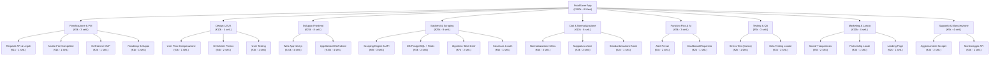

<h1>La nostra app rivoluziona il mondo del food delivery</h1>

offrendo un’esperienza più trasparente, intelligente e conveniente rispetto ai principali competitor come Glovo o Deliveroo.

A differenza delle piattaforme tradizionali, non esiste alcun costo di abbonamento: ogni utente può accedere gratuitamente a tutte le funzionalità, con la possibilità di scegliere un piano Plus opzionale per vantaggi aggiuntivi.

Grazie a un potente sistema di confronto prezzi in tempo reale, l’app trova automaticamente le migliori offerte e il prezzo più conveniente per il piatto che desideri nella tua zona. Ad esempio, se cerchi una pizza margherita, la piattaforma confronterà i prezzi dei ristoranti vicini e selezionerà quello con il miglior rapporto qualità/prezzo, facendoti risparmiare tempo e denaro.

<h2>Problema</h2>

Non avere abbastanza soldi per mangiare.

<h2>Target</h2>

Qualunque acquistatore di cibo online.

<h2>Competitors</h2>

Glovo, Deliveroo, Uber Eats, Just Eat, Prestofood.it, 

<h2>Tagline</h2>

<strong>Vuoi mangiare senza sentirti in colpa per il prezzo? Scegli CheapEat!</strong>

<h2>Requisiti</h2>
<h3>Analisi dei Requisiti – App di Food Delivery Intelligente</h3>

<h4>🔹 Descrizione del Progetto</h4>

App che confronta in tempo reale i prezzi dei ristoranti e permette di ordinare al miglior prezzo.
Differenze rispetto ai competitor: accesso gratuito, trasparenza costi, supporto umano rapido, tracking preciso.

<h4>⚙️ Requisiti Funzionali</h4>
<ul>
  <li>Ricerca di piatti/ristoranti nella zona.</li>
  <li>Confronto automatico dei prezzi.</li>
  <li>Ordine diretto tramite app.</li>
  <li>Tracking in tempo reale dell’ordine.</li>
  <li>Pagamento elettronico o alternativo.</li>
  <li>Chat di supporto 24/7.</li>
  <li>Recensioni e valutazioni.</li>
  <li>Offerte personalizzate.</li>
</ul>

<h4>🔧 Requisiti Non Funzionali</h4>
<ul>
  <li>Prestazioni: risposta &lt; 2s.</li>
  <li>Affidabilità: disponibilità ≥ 99,5%.</li>
  <li>Usabilità: interfaccia intuitiva e coerente.</li>
  <li>Compatibilità: iOS, Android, Web.</li>
  <li>Sicurezza: crittografia HTTPS e protezione dati.</li>
  <li>Trasparenza: costi sempre visibili.</li>
  <li>Supporto: risposta entro 2 min.</li>
</ul>

<h4>🧩 Requisiti di Dominio</h4>
<ul>
  <li>Conformità a GDPR e norme sul consumatore.</li>
  <li>Dati e prezzi da fonti verificate.</li>
  <li>Standard igienico-sanitari per i corrieri.</li>
  <li>Integrazione con API e database partner.</li>
</ul>

<h2>Use Case UML</h2>
https://yuml.me/1a320501.svg

<h2>Sito Web Lovable</h2>
(https://taste-track-deal.lovable.app)

<h2>Elevator Pitch</h2>
"Ogni giorno, milioni di persone ordinano cibo a domicilio, ma perdono tempo saltando da un’app all’altra per capire chi ha la consegna gratuita o il prezzo più basso, finendo spesso per pagare di più senza accorgersene.
La nostra app è lo 'Skyscanner del Food Delivery'. Rivoluzioniamo il settore portando una trasparenza radicale: il nostro algoritmo confronta in tempo reale i prezzi di tutti i servizi di delivery nella tua zona per lo stesso piatto, trovando automaticamente l'offerta migliore per rapporto qualità/prezzo.
A differenza dei giganti del settore, noi non chiediamo abbonamenti per le funzioni base. Offriamo un servizio gratuito che fa risparmiare l'utente immediatamente, con un modello 'Plus' opzionale per chi vuole vantaggi esclusivi. Stiamo restituendo il potere di scelta al consumatore, garantendo la pizza migliore al prezzo più basso, in un solo click.
Sono qui per chiedere 50.000€ per assumere personale per quanto riguarda l assistenza clienti e sviluppare una web app competitiva"
Sono disposto a cedere il 20 percento della mia azienda per questo investimento.

<h2>Wbs</h2>

```mermaid
 graph TD
    A["FoodSaver App<br/>(€100k - 6 Mesi)"] --> B["Pianificazione & PM<br/>(€5k - 3 sett.)"]
    A --> C["Design UI/UX<br/>(€10k - 4 sett.)"]
    A --> D["Sviluppo Frontend<br/>(€25k - 8 sett.)"]
    A --> E["Backend & Scraping<br/>(€25k - 8 sett.)"]
    A --> F["Dati & Normalizzazione<br/>(€10k - 6 sett.)"]
    A --> G["Funzioni Plus & AI<br/>(€5k - 3 sett.)"]
    A --> H["Testing & QA<br/>(€5k - 3 sett.)"]
    A --> I["Marketing & Lancio<br/>(€10k - 4 sett.)"]
    A --> J["Supporto & Manutenzione<br/>(€5k - 4 sett.)"]

    B --> B1["Requisiti API & Legali<br/>(€1k - 1 sett.)"]
    B --> B2["Analisi Fee Competitor<br/>(€1k - 1 sett.)"]
    B --> B3["Definizione MVP<br/>(€2k - 1 sett.)"]
    B --> B4["Roadmap Sviluppo<br/>(€1k - 1 sett.)"]

    C --> C1["User Flow Comparazione<br/>(€3k - 1 sett.)"]
    C --> C2["UI Schede Prezzo<br/>(€4k - 2 sett.)"]
    C --> C3["User Testing<br/>(€3k - 1 sett.)"]

    D --> D1["Web App Next.js<br/>(€10k - 4 sett.)"]
    D --> D2["App Ibrida iOS/Android<br/>(€15k - 4 sett.)"]

    E --> E1["Scraping Engine & API<br/>(€8k - 3 sett.)"]
    E --> E2["DB PostgreSQL + Redis<br/>(€5k - 2 sett.)"]
    E --> E3["Algoritmo 'Best Deal'<br/>(€7k - 2 sett.)"]
    E --> E4["Sicurezza & Auth<br/>(€5k - 1 sett.)"]

    F --> F1["Normalizzazione Menu<br/>(€5k - 3 sett.)"]
    F --> F2["Mappatura Zone<br/>(€3k - 2 sett.)"]
    F --> F3["Standardizzazione Nomi<br/>(€2k - 1 sett.)"]

    G --> G1["Alert Prezzi<br/>(€3k - 2 sett.)"]
    G --> G2["Dashboard Risparmio<br/>(€2k - 1 sett.)"]

    H --> H1["Stress Test (Carico)<br/>(€2k - 1 sett.)"]
    H --> H2["Beta Testing Locale<br/>(€3k - 2 sett.)"]

    I --> I1["Social 'Trasparenza'<br/>(€5k - 2 sett.)"]
    I --> I2["Partnership Locali<br/>(€3k - 1 sett.)"]
    I --> I3["Landing Page<br/>(€2k - 1 sett.)"]

    J --> J1["Aggiornamenti Scraper<br/>(€3k - 2 sett.)"]
    J --> J2["Monitoraggio API<br/>(€2k - 2 sett.)"]
```

<h4>🧩Diagramma di Gantt</h4>

gantt
    title CheapEat – Piano di Sviluppo (6 mesi)
    dateFormat  YYYY-MM-DD
    axisFormat  %d/%m

    section Pianificazione
    Pianificazione & PM           :a1, 2026-03-01, 3w
    Requisiti API & Legali         :a2, after a1, 1w
    Analisi Fee Competitor         :a3, after a1, 1w
    Definizione MVP                :a4, after a1, 1w
    Roadmap Sviluppo               :a5, after a1, 1w

    section Design UI/UX
    User Flow Comparazione         :b1, after a1, 1w
    UI Schede Prezzo               :b2, after b1, 2w
    User Testing                   :b3, after b2, 1w

    section Backend & Dati
    Scraping Engine & API          :c1, after a4, 3w
    Database (Postgres + Redis)    :c2, after c1, 2w
    Algoritmo Best Deal            :c3, after c2, 2w
    Sicurezza & Autenticazione     :c4, after c3, 1w

    Normalizzazione Menu           :d1, after c1, 3w
    Mappatura Zone                 :d2, after d1, 2w
    Standardizzazione Nomi         :d3, after d2, 1w

    section Frontend
    Web App (Next.js)              :e1, after b3, 4w
    App Ibrida iOS/Android         :e2, after e1, 4w

    section Funzioni Plus
    Alert Prezzi                   :f1, after c3, 2w
    Dashboard Risparmio            :f2, after f1, 1w

    section Testing & QA
    Stress Test                    :g1, after e2, 1w
    Beta Testing Locale            :g2, after g1, 2w

    section Marketing & Lancio
    Landing Page                   :h1, after b3, 1w
    Social “Trasparenza”           :h2, after h1, 2w
    Partnership Locali             :h3, after h2, 1w

    section Supporto & Post-Lancio
    Supporto Clienti Attivo        :i1, after g2, 4w
    Aggiornamenti Scraper          :i2, after g2, 2w
    Monitoraggio API               :i3, after g2, 2w
