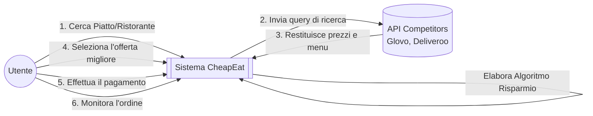
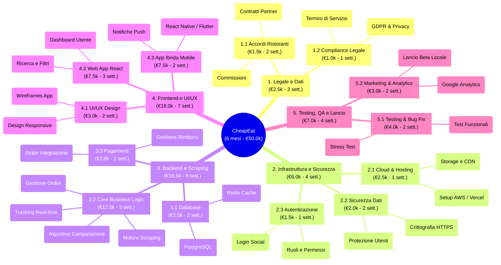
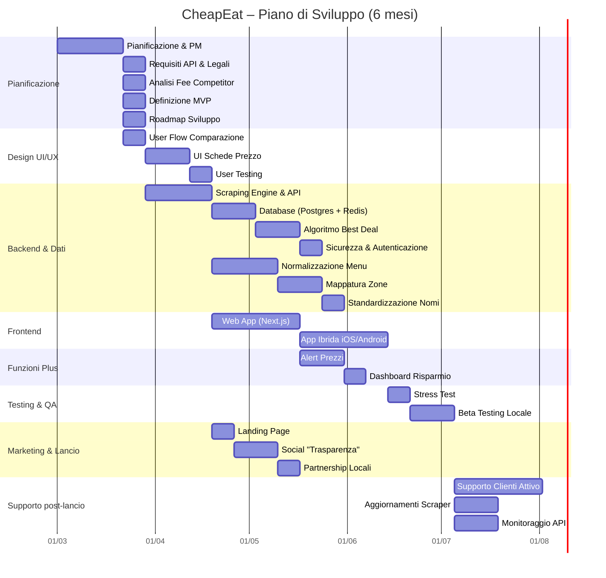

# CheapEat - Lo "Skyscanner" del Food Delivery 🍔🍕

**Autore:** Gusmini Enrico

## Legenda e Navigazione

- [Descrizione e Visione](#descrizione-e-visione)
- [Analisi di Mercato](#analisi-di-mercato) (Problema, Target, Competitors, Analisi Comparativa)
- [Specifiche Tecniche](#specifiche-tecniche)
- [Analisi dei Requisiti](#analisi-dei-requisiti) (Dettagli, Elenco e User Stories)
- [Modellazione e Prototipazione](#modellazione-e-prototipazione) (UML e Prototipo)
- [Business Strategy](#business-strategy) (Pitch, Slide Mentali, WBS e Gantt)

---

## Descrizione e Visione

La nostra app rivoluziona il mondo del food delivery offrendo un’esperienza più **trasparente, intelligente e conveniente** rispetto ai principali competitor come Glovo o Deliveroo. 

A differenza delle piattaforme tradizionali, **non esiste alcun costo di abbonamento obbligatorio**: ogni utente può accedere gratuitamente a tutte le funzionalità di base, con la possibilità di scegliere un piano Plus opzionale per vantaggi aggiuntivi. 

Grazie a un potente sistema di **confronto prezzi in tempo reale**, l’app trova automaticamente le migliori offerte e il prezzo più conveniente per il piatto che desideri nella tua zona. Ad esempio, se cerchi una pizza margherita, la piattaforma confronterà i prezzi dei ristoranti vicini e delle diverse app di delivery, selezionando la combinazione con il miglior rapporto qualità/prezzo e azzerando i costi nascosti.

✨ **Trasparenza radicale, zero abbonamenti per le funzioni base e il potere di scelta restituito al consumatore.**

---

## Analisi di Mercato

### Problema
L'ostacolo principale nel mercato attuale del food delivery è la **mancanza di trasparenza sui prezzi e le commissioni elevate**. Gli utenti perdono tempo passando da un'app all'altra (Glovo, Deliveroo, Just Eat) per capire chi offre la consegna gratuita o il prezzo più basso, finendo spesso per pagare ricarichi nascosti o spese di servizio gonfiate che rendono proibitivo ordinare regolarmente, specialmente per chi ha un budget limitato.

### Target
Il servizio si rivolge specificamente a: **Studenti, giovani lavoratori e qualsiasi acquirente di cibo online** che desidera ottimizzare le proprie spese quotidiane senza rinunciare alla comodità del delivery.

### Competitors
I principali player del mercato sono piattaforme consolidate ma chiuse nel proprio ecosistema:
- Glovo
- Deliveroo
- Uber Eats
- Just Eat
- Prestofood.it

### Analisi Comparativa

| 🧩 Caratteristica | ⭐ Importanza | 🍔 CheapEat | 🟡 Glovo | 🟢 Deliveroo | 🟠 Just Eat |
|:---|:---|:---|:---|:---|:---|
| **Comparazione prezzi multi-app** | 🔥 High | 🟢 Automatica in tempo reale | 🔴 Assente | 🔴 Assente | 🔴 Assente |
| **Trasparenza totale sui costi** | 🔥 High | 🟢 Costi di servizio e consegna espliciti | 🟠 Spesso nascosti fino al checkout | 🟠 Variabili | 🟠 Variabili |
| **Piano gratuito completo** | 🔥 High | 🟢 Nessun abbonamento per confrontare | 🟠 Base gratuita, ma costi extra alti | 🟠 Base gratuita | 🟢 Base gratuita |
| **Assistenza Clienti Rapida (< 2min)**| 🔥 High | 🟢 Supporto umano garantito | 🔴 Spesso tramite bot | 🟠 Lenta | 🔴 Spesso tramite bot |
| **Piano "Plus" opzionale (Vantaggi)**| 🟡 Mod. | 🟢 Alert prezzi e dashboard risparmio | 🟢 Glovo Prime | 🟢 Deliveroo Plus | 🔴 Assente |
| **Scelta basata sul risparmio** | 🔥 High | 🟢 Core dell'algoritmo | 🔴 Basato su prossimità/sponsor | 🔴 Basato su popolarità | 🔴 Basato su recensioni |

### Tagline
> *"Vuoi mangiare senza sentirti in colpa per il prezzo? Scegli CheapEat!"*

---

## Specifiche Tecniche

Per supportare un'architettura di scraping e comparazione dati in tempo reale, lo stack tecnologico scelto è orientato alle performance:
- **Frontend Web:** Next.js (React) + Tailwind CSS → Interfaccia utente fluida, ottimizzata e reattiva.
- **App Mobile:** React Native o Flutter (iOS/Android) per una codebase ibrida e sviluppo rapido.
- **Backend & Motore di Scraping:** Node.js / Python (BeautifulSoup, Scrapy) → Per l'ingestione e la normalizzazione dei menu e dei prezzi.
- **Database:** PostgreSQL (Dati relazionali, utenti, ordini) + Redis (Caching vitale per mantenere le risposte < 2s durante le ricerche dei prezzi).
- **Autenticazione:** OAuth 2.0 / JWT.
- **Infrastruttura e Cloud:** AWS o Vercel per scalabilità dinamica nei momenti di picco (es. orari dei pasti).
- **Sicurezza:** Crittografia HTTPS, protezione dei dati personali GDPR compliant.

---

## Analisi dei Requisiti

### Descrizione dei requisiti
L'applicazione **CheapEat** permette agli utenti di registrarsi gratuitamente o accedere come ospiti per cercare ristoranti o piatti specifici nella propria area (funzionale). L'algoritmo interno elabora i dati, effettuando un **confronto automatico dei prezzi** tra le diverse piattaforme di delivery e mostrando le opzioni più convenienti (funzionale). 
L'utente può poi completare l'ordine direttamente tramite l'app o essere reindirizzato all'offerta migliore, monitorando il **tracking in tempo reale** dell'ordine (funzionale).
Gli utenti registrati possono accedere a un piano **Plus** opzionale che offre funzionalità avanzate come *Alert Prezzi* sui piatti preferiti e una *Dashboard del Risparmio* (funzionale).
Il sistema garantisce **tempi di risposta inferiori a 2 secondi**, alta disponibilità (99,5%) e un'interfaccia coerente cross-platform (non funzionale). La piattaforma si affida a fonti di dati verificate, rispetta il GDPR e garantisce trasparenza assoluta dei costi in ogni fase (di dominio).

### Elenco Riassuntivo Requisiti

**Funzionali**
1. Ricerca avanzata di piatti e ristoranti geolocalizzati.
2. Comparazione automatica e in tempo reale dei prezzi tra i competitor.
3. Ordine diretto tramite l'app o redirect ottimizzato.
4. Tracking in tempo reale dello stato dell'ordine.
5. Pagamento elettronico sicuro integrato.
6. Chat di supporto clienti con risposta garantita entro 2 minuti.
7. Gestione recensioni e valutazioni incrociate.
8. Dashboard risparmio e notifiche (Alert prezzi) per utenti Plus.

**Non Funzionali**
1. Tempi di risposta del motore di ricerca inferiori a 2 secondi.
2. Affidabilità e disponibilità del sistema ≥ 99,5%.
3. Interfaccia intuitiva (UI/UX) compatibile con Web, iOS e Android.
4. Crittografia HTTPS e sicurezza per i pagamenti.

**Di Dominio**
1. Conformità completa alle normative GDPR.
2. Estrazione dati, prezzi e menu da fonti verificate e pubbliche.
3. Integrazione stabile con API di partner e sistemi di pagamento.

### User Stories

| Attore (Come...) | Requisito / Azione (Voglio...) | Beneficio (In modo da...) |
|:---|:---|:---|
| Utente | cercare un piatto specifico (es. pizza margherita) | trovare tutti i ristoranti in zona che lo offrono. |
| Utente | confrontare i prezzi totali (inclusa consegna) | scegliere l'opzione più economica senza fare calcoli manuali. |
| Utente | creare un account gratuito | salvare i miei indirizzi e i metodi di pagamento. |
| Utente | abbonarmi al piano Plus opzionale | attivare gli alert di prezzo per i miei piatti preferiti. |
| Utente | visualizzare il tracking dell'ordine | sapere esattamente quando arriverà il mio cibo. |
| Utente | contattare l'assistenza clienti via chat | risolvere rapidamente un problema con l'ordine o il pagamento. |
| Utente | visualizzare la scomposizione esatta del prezzo | non avere brutte sorprese o commissioni nascoste al checkout. |
| Amministratore | monitorare i log del motore di scraping | assicurarsi che i prezzi dei competitor siano sempre aggiornati. |

---

## Modellazione e Prototipazione

### Use Case UML
*Lo schema seguente illustra le interazioni primarie tra l'utente, il sistema di comparazione e i servizi esterni.*

```mermaid
flowchart LR
    %% Attori
    U((Utente))
    S[[Sistema CheapEat]]
    API[(API Competitors\nGlovo, Deliveroo)]

    %% Azioni Utente
    U -->|1. Cerca Piatto/Ristorante| S
    U -->|4. Seleziona l'offerta migliore| S
    U -->|5. Effettua il pagamento| S
    U -->|6. Monitora l'ordine| S

    %% Azioni Sistema
    S -->|2. Invia query di ricerca| API
    API -->|3. Restituisce prezzi e menu| S
    S -->|Elabora Algoritmo Risparmio| S
```

### Prototipo Basato Sui Requisiti
Accesso diretto alla versione interattiva (Lovable) della piattaforma:
👉 **[Guarda il prototipo su Lovable](https://taste-track-deal.lovable.app/)**

---

## Business Strategy

### Slide Mentali (Pitch Deck)

- **Slide 1: Intro:** Nome Compagnia (CheapEat), Slogan ("Lo Skyscanner del food delivery"), Contatti.
- **Slide 2: Il Problema:** Troppe app, costi di consegna variabili, ricarichi sui prezzi nascosti. Mangiare a casa costa troppo e richiede troppo tempo per confrontare le offerte.
- **Slide 3: La Soluzione:** Una singola app che centralizza, scansiona e confronta in tempo reale i prezzi di tutti i delivery nella zona dell'utente.
- **Slide 4: Market Size:** Il mercato del food delivery vale miliardi. Milioni di utenti cercano quotidianamente di abbassare lo scontrino medio.
- **Slide 5: Modello di Business:** Completamente gratuito per l'utente base. Monetizzazione tramite: 1) Affiliazione/Lead generation inviando ordini alle piattaforme partner; 2) Modello freemium con abbonamento "Plus" opzionale per alert prezzi avanzati.
- **Slide 6: La Richiesta:** Ricerca di 50.000€ (per il 20% di equity) da destinare allo sviluppo della Web App, al backend di scraping e all'assunzione di personale per l'assistenza clienti rapida.

### L'Elevator Pitch
*"Ogni giorno, milioni di persone ordinano cibo a domicilio, ma perdono tempo saltando da un’app all’altra per capire chi ha la consegna gratuita o il prezzo più basso, finendo spesso per pagare di più senza accorgersene. La nostra app è lo **'Skyscanner del Food Delivery'**. Rivoluzioniamo il settore portando una trasparenza radicale: il nostro algoritmo confronta in tempo reale i prezzi di tutti i servizi di delivery nella tua zona per lo stesso piatto, trovando automaticamente l'offerta migliore per rapporto qualità/prezzo. A differenza dei giganti del settore, noi non chiediamo abbonamenti per le funzioni base. Offriamo un servizio gratuito che fa risparmiare l'utente immediatamente, con un modello 'Plus' opzionale per chi vuole vantaggi esclusivi. Stiamo restituendo il potere di scelta al consumatore, garantendo la pizza migliore al prezzo più basso, in un solo click. Sono qui per chiedere 50.000€ per assumere personale per quanto riguarda l'assistenza clienti e sviluppare una web app competitiva. Sono disposto a cedere il 20% della mia azienda per questo investimento."*

### WBS (Work Breakdown Structure)

Pianificazione dettagliata delle fasi di sviluppo e relativi costi:

```mermaid
mindmap
  root(("CheapEat<br/>(6 mesi - €50.0k)"))
    1["1. Legale e Dati<br/>(€2.5k - 3 sett.)"]
      1_1["1.1 Accordi Ristoranti<br/>(€1.5k - 2 sett.)"]
        1_1_1(Contratti Partner)
        1_1_2(Commissioni)
      1_2["1.2 Compliance Legale<br/>(€1.0k - 1 sett.)"]
        1_2_1(GDPR & Privacy)
        1_2_2(Termini di Servizio)
    2["2. Infrastruttura e Sicurezza<br/>(€6.0k - 4 sett.)"]
      2_1["2.1 Cloud & Hosting<br/>(€2.5k - 1 sett.)"]
        2_1_1(Setup AWS / Vercel)
        2_1_2(Storage e CDN)
      2_2["2.2 Sicurezza Dati<br/>(€2.0k - 2 sett.)"]
        2_2_1(Crittografia HTTPS)
        2_2_2(Protezione Utenti)
      2_3["2.3 Autenticazione<br/>(€1.5k - 1 sett.)"]
        2_3_1(Login Social)
        2_3_2(Ruoli e Permessi)
    3["3. Backend e Scraping<br/>(€16.5k - 8 sett.)"]
      3_1["3.1 Database<br/>(€2.5k - 2 sett.)"]
        3_1_1(PostgreSQL)
        3_1_2(Redis Cache)
      3_2["3.2 Core Business Logic<br/>(€12.0k - 5 sett.)"]
        3_2_1(Motore Scraping)
        3_2_2(Algoritmo Comparazione)
        3_2_3(Gestione Ordini)
        3_2_4(Tracking Real-time)
      3_3["3.3 Pagamenti<br/>(€2.0k - 1 sett.)"]
        3_3_1(Stripe Integrazione)
        3_3_2(Gestione Rimborsi)
    4["4. Frontend e UI/UX<br/>(€18.0k - 7 sett.)"]
      4_1["4.1 UI/UX Design<br/>(€3.0k - 2 sett.)"]
        4_1_1(Wireframes App)
        4_1_2(Design Responsive)
      4_2["4.2 Web App React<br/>(€7.5k - 3 sett.)"]
        4_2_1(Dashboard Utente)
        4_2_2(Ricerca e Filtri)
      4_3["4.3 App Ibrida Mobile<br/>(€7.5k - 2 sett.)"]
        4_3_1(React Native / Flutter)
        4_3_2(Notifiche Push)
    5["5. Testing, QA e Lancio<br/>(€7.0k - 4 sett.)"]
      5_1["5.1 Testing & Bug Fix<br/>(€4.0k - 2 sett.)"]
        5_1_1(Test Funzionali)
        5_1_2(Stress Test)
      5_2["5.2 Marketing & Analytics<br/>(€3.0k - 2 sett.)"]
        5_2_1(Google Analytics)
        5_2_2(Lancio Beta Locale)
```
### Diagramma di Gantt
*Pianificazione temporale delle fasi di sviluppo previste per i primi 6 mesi.*

```mermaid
gantt
    title CheapEat – Piano di Sviluppo (6 mesi)
    dateFormat  YYYY-MM-DD
    axisFormat  %d/%m

    section Pianificazione
    Pianificazione & PM           :a1, 2026-03-01, 21d
    Requisiti API & Legali        :a2, after a1, 7d
    Analisi Fee Competitor        :a3, after a1, 7d
    Definizione MVP               :a4, after a1, 7d
    Roadmap Sviluppo              :a5, after a1, 7d

    section Design UI/UX
    User Flow Comparazione        :b1, after a1, 7d
    UI Schede Prezzo              :b2, after b1, 14d
    User Testing                  :b3, after b2, 7d

    section Backend & Dati
    Scraping Engine & API         :c1, after a4, 21d
    Database (Postgres + Redis)   :c2, after c1, 14d
    Algoritmo Best Deal           :c3, after c2, 14d
    Sicurezza & Autenticazione    :c4, after c3, 7d
    Normalizzazione Menu          :d1, after c1, 21d
    Mappatura Zone                :d2, after d1, 14d
    Standardizzazione Nomi        :d3, after d2, 7d

    section Frontend
    Web App (Next.js)             :e1, after b3, 28d
    App Ibrida iOS/Android        :e2, after e1, 28d

    section Funzioni Plus
    Alert Prezzi                  :f1, after c3, 14d
    Dashboard Risparmio           :f2, after f1, 7d

    section Testing & QA
    Stress Test                   :g1, after e2, 7d
    Beta Testing Locale           :g2, after g1, 14d

    section Marketing & Lancio
    Landing Page                  :h1, after b3, 7d
    Social "Trasparenza"          :h2, after h1, 14d
    Partnership Locali            :h3, after h2, 7d

    section Supporto post-lancio
    Supporto Clienti Attivo       :i1, after g2, 28d
    Aggiornamenti Scraper         :i2, after g2, 14d
    Monitoraggio API              :i3, after g2, 14d
```
